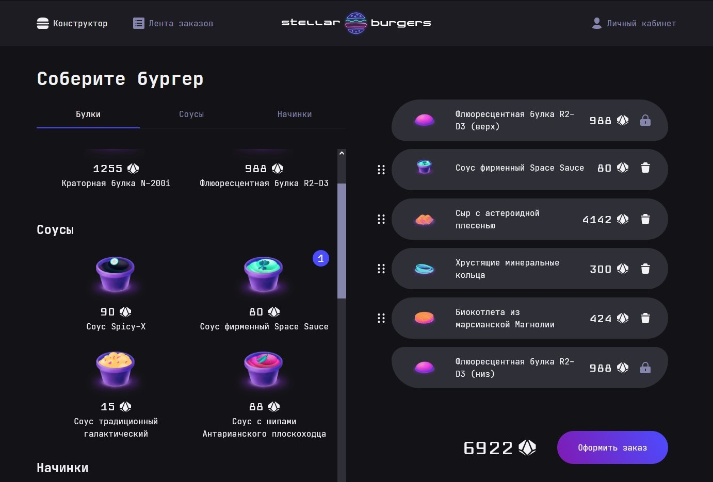
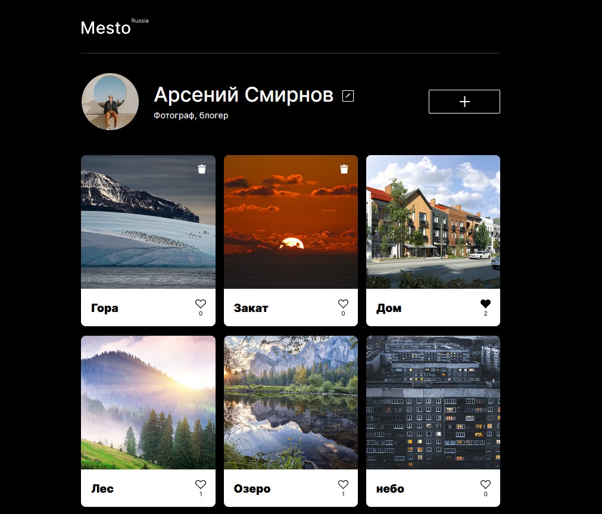
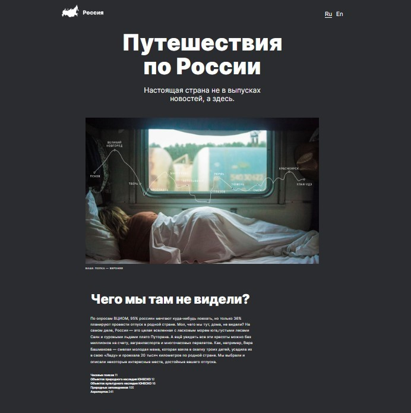

## Welcome to my GitHub!

I'm a begginer front-end developer.

### Technologies i'm using:

  &nbsp;
  &nbsp;
  &nbsp;
  &nbsp;
  &nbsp;
  &nbsp;

### Check out my projects:

[**Stellar Burgers React Project**](https://github.com/keepitdown/react-burger)

[**Mesto Vanilla JS Project**](https://github.com/keepitdown/mesto-project-bootcamp)

[**Travel Across Russia Adaptive Layout Project**](https://github.com/keepitdown/russian-travel-bootcamp)

